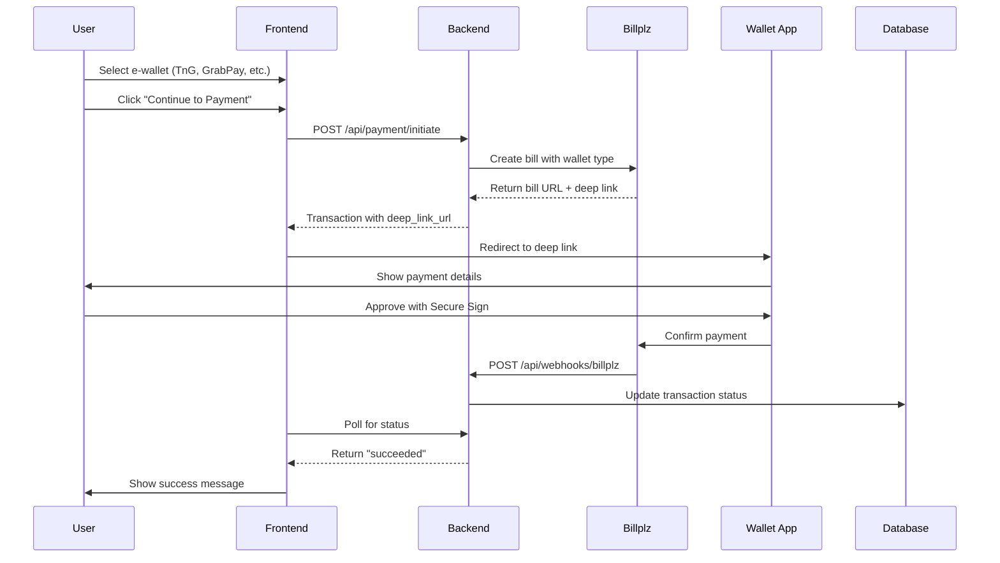

# E-Wallet Payment Integration Guide

## Overview

This guide explains the complete e-wallet payment flow for Touch 'n Go eWallet, GrabPay, Boost, and ShopeePay using Billplz as the payment gateway.

## Payment Flow

### 1. User Initiates Payment



## Implementation Details

### Backend (Laravel)

#### 1. E-Wallet Payment Processing

**File**: `backend/app/Services/PaymentService.php`

```php
public function processEWalletPayment(User $user, array $data): Transaction
{
    // Supported wallets: tng, grabpay, boost, shopeepay
    $walletType = $data['wallet_type'];
    
    // Creates transaction with 'pending' status
    // Calls Billplz API to create bill
    // Returns deep link for app redirection
}
```

#### 2. Deep Link Generation

Deep links are generated to open the wallet apps directly:

- **Touch 'n Go**: `tngd://payment?url=...`
- **GrabPay**: `grab://payment?url=...`
- **Boost**: `boostapp://payment?url=...`
- **ShopeePay**: `shopeemy://payment?url=...`

**Function**: `generateEWalletDeepLink()`

```php
protected function generateEWalletDeepLink(string $walletType, string $paymentUrl): string
{
    switch ($walletType) {
        case 'tng':
            return 'tngd://payment?url=' . urlencode($paymentUrl);
        // ... other wallets
    }
}
```

#### 3. Webhook Handling

**Endpoint**: `POST /api/webhooks/billplz`

When the user approves payment in their wallet app, Billplz sends a webhook to update the transaction status.

**File**: `backend/app/Http/Controllers/Api/WebhookController.php`

```php
public function handleBillplz(Request $request)
{
    // 1. Verify X-Signature
    // 2. Parse webhook payload
    // 3. Find transaction by bill_id
    // 4. Update status to 'succeeded' if paid
    // 5. Log webhook event
}
```

**Webhook Payload Example**:
```json
{
    "id": "bill_abc123",
    "collection_id": "col_xyz",
    "paid": "true",
    "state": "paid",
    "amount": "10000",
    "paid_at": "2025-11-14 15:30:00",
    "transaction_id": "T123456",
    "transaction_status": "completed"
}
```

### Frontend (Nuxt 3)

#### 1. E-Wallet Selector Component

**File**: `frontend/components/EWalletSelector.vue`

**Features**:
- Displays 4 wallet options (TnG, GrabPay, Boost, ShopeePay)
- Generates payment link via API
- Auto-opens wallet app on mobile devices
- Polls transaction status every 3 seconds
- Shows QR code as fallback for desktop

**Key Functions**:

```javascript
const handlePayment = async () => {
    // 1. Call initiatePayment API
    // 2. Extract deep_link_url from response
    // 3. Auto-redirect on mobile devices
    // 4. Start status polling
}

const isMobile = () => {
    return /Android|iPhone|iPad/i.test(navigator.userAgent)
}

const startStatusCheck = () => {
    // Poll every 3 seconds for status changes
    // Stop when status = 'succeeded' or 'failed'
}
```

#### 2. Payment Status Page

**File**: `frontend/pages/payment/status.vue`

After the user completes payment in their wallet app, they are redirected to this page.

**URL**: `/payment/status?transaction_id=xxx`

**States**:
- ✅ **Success**: Payment approved
- ⏳ **Pending**: Waiting for webhook
- ❌ **Failed**: Payment declined
- ⚠️ **Cancelled**: User cancelled

## Configuration

### Backend Environment Variables

```env
# Billplz Configuration
BILLPLZ_ENABLED=true
BILLPLZ_API_KEY=your_api_key_here
BILLPLZ_COLLECTION_ID=your_collection_id
BILLPLZ_X_SIGNATURE_KEY=your_signature_key
BILLPLZ_SANDBOX=true  # Set to false in production
```

### Billplz API Setup

1. **Sign up** at [Billplz.com](https://www.billplz.com)
2. **Create Collection** (like a payment bucket)
3. **Get API Key** from Settings > API Keys
4. **Set X Signature Key** for webhook verification
5. **Configure Webhook URL**: `https://yourdomain.com/api/webhooks/billplz`

### Webhook Configuration in Billplz

1. Go to **Settings > Webhooks**
2. Add webhook URL: `https://yourdomain.com/api/webhooks/billplz`
3. Select events: `bill.paid`, `bill.deleted`
4. Save and test

## Testing

### Test E-Wallet Payment Flow

#### Using Billplz Sandbox

1. **Set environment**:
   ```env
   BILLPLZ_SANDBOX=true
   ```

2. **Use test credentials** from Billplz sandbox

3. **Test payment**:
   - Select any e-wallet
   - Click "Continue to Payment"
   - In sandbox, you'll get a mock payment page
   - Click "Pay" to simulate successful payment
   - Webhook will fire automatically

#### Test Cards (Billplz Sandbox)

- **Success**: Any amount ending in `.00` (e.g., RM 10.00)
- **Failed**: Any amount ending in `.01` (e.g., RM 10.01)

### Webhook Testing

Use [ngrok](https://ngrok.com) for local webhook testing:

```bash
# Start ngrok
ngrok http 8000

# Update Billplz webhook URL
https://abc123.ngrok.io/api/webhooks/billplz
```

## Security

### Webhook Signature Verification

All webhooks are verified using HMAC SHA256:

```php
$data = [
    'amount' => $payload['amount'],
    'collection_id' => $payload['collection_id'],
    'id' => $payload['id'],
    'paid' => $payload['paid'],
    'paid_at' => $payload['paid_at'],
    'state' => $payload['state'],
];

$generatedSignature = hash_hmac('sha256', http_build_query($data), $signatureKey);
$signatureVerified = hash_equals($generatedSignature, $xSignature);
```

### Best Practices

1. **Always verify signatures** in production
2. **Log all webhook events** for audit trail
3. **Use HTTPS** for webhook endpoints
4. **Implement idempotency** (don't process same webhook twice)
5. **Return 200 OK** quickly to avoid retries

## Troubleshooting

### Deep Link Not Opening App

**Problem**: Clicking "Open App" doesn't launch wallet app

**Solutions**:
- Ensure user has the wallet app installed
- Check if browser blocks app redirection (Safari/Chrome settings)
- Use QR code as fallback on desktop

### Webhook Not Received

**Problem**: Payment approved in app but status stays "pending"

**Solutions**:
1. Check Billplz webhook configuration
2. Verify webhook URL is publicly accessible
3. Check Laravel logs: `storage/logs/laravel.log`
4. Review webhook logs in Billplz dashboard
5. Test webhook signature verification

### Transaction Status Not Updating

**Problem**: Frontend polling doesn't see status change

**Solutions**:
1. Check webhook was received: `webhook_logs` table
2. Verify transaction was updated: `transactions` table
3. Check for webhook processing errors in logs
4. Ensure transaction ID matches between frontend and webhook

## Database Schema

### Transactions Table

```sql
CREATE TABLE transactions (
    id BIGINT UNSIGNED AUTO_INCREMENT PRIMARY KEY,
    user_id BIGINT UNSIGNED NOT NULL,
    transaction_id VARCHAR(255) UNIQUE NOT NULL,
    payment_rail ENUM('card', 'fpx', 'ewallet', 'manual_bank'),
    provider VARCHAR(50), -- 'billplz', 'stripe', etc.
    provider_transaction_id VARCHAR(255), -- Billplz bill_id
    amount DECIMAL(10, 2) NOT NULL,
    currency VARCHAR(3) DEFAULT 'MYR',
    status ENUM('pending', 'processing', 'succeeded', 'failed', 'cancelled'),
    ewallet_type VARCHAR(50), -- 'tng', 'grabpay', 'boost', 'shopeepay'
    metadata JSON, -- Stores deep_link_url, qr_code_url, etc.
    paid_at TIMESTAMP NULL,
    created_at TIMESTAMP DEFAULT CURRENT_TIMESTAMP
);
```

### Webhook Logs Table

```sql
CREATE TABLE webhook_logs (
    id BIGINT UNSIGNED AUTO_INCREMENT PRIMARY KEY,
    provider VARCHAR(50), -- 'billplz'
    event_type VARCHAR(100), -- 'bill.paid', 'bill.deleted'
    event_id VARCHAR(255), -- Billplz bill_id
    payload JSON,
    signature_verified BOOLEAN,
    status ENUM('pending', 'processed', 'failed'),
    error_message TEXT NULL,
    created_at TIMESTAMP DEFAULT CURRENT_TIMESTAMP
);
```

## Fees & Pricing

### Billplz Transaction Fees (Malaysia)

- **FPX**: 1.5% (RM 0.50 - RM 2.00 cap)
- **E-wallets**: 
  - Touch 'n Go: 1.5% + RM 0.30
  - GrabPay: 2.0% + RM 0.30
  - Boost: 2.0% + RM 0.30
  - ShopeePay: 2.5% + RM 0.30

*Note: Fees may vary. Check Billplz pricing page for latest rates.*

## Support

- **Billplz Documentation**: https://www.billplz.com/api
- **Billplz Support**: support@billplz.com
- **Project Issues**: Create issue in GitHub repository

## License

This integration is part of the NFC Business Card project.
